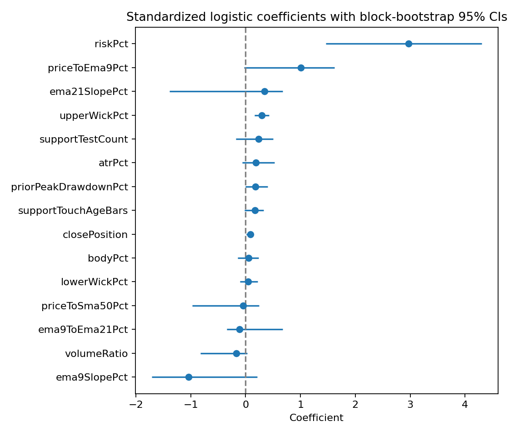
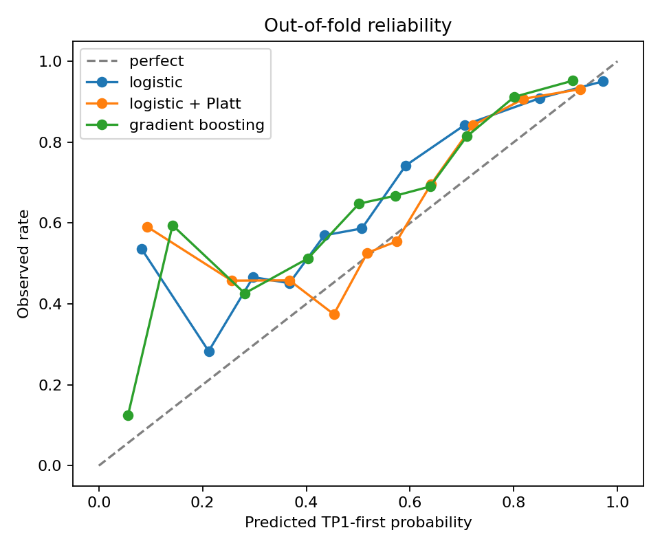
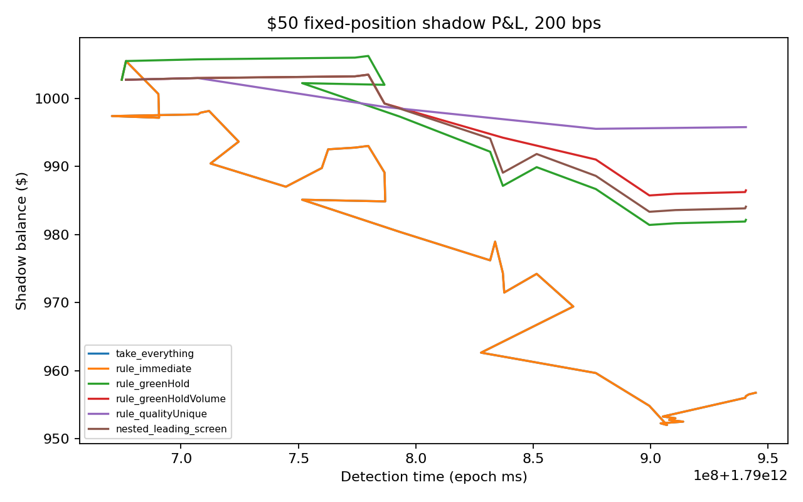
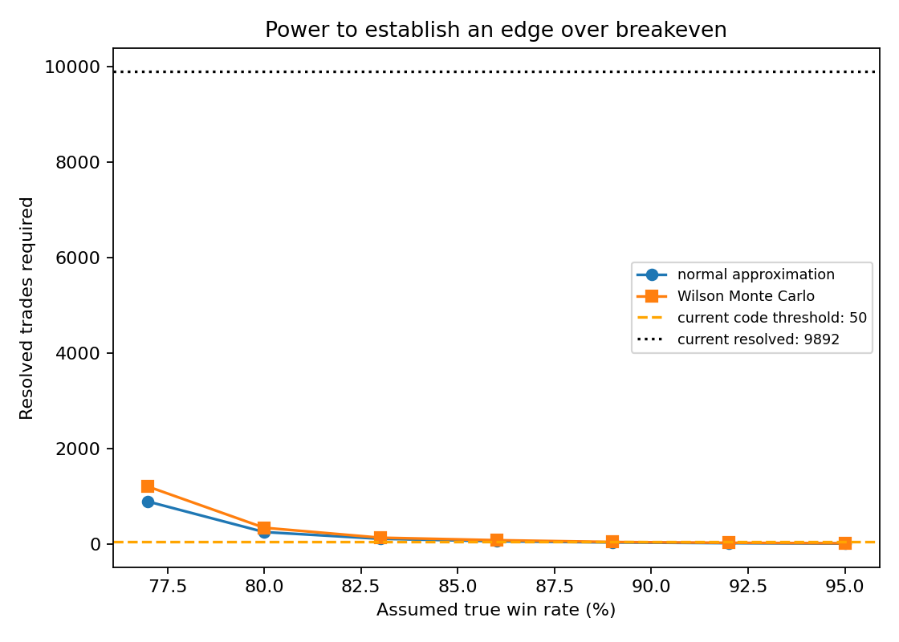

# Offline ML research report

> **PRODUCTION SNAPSHOT**

## 1. Research question

Do point-in-time setup features predict TP1-first outcomes better than the hand-written rules, net of modeled costs? Model inferiority or statistical indistinguishability is a valid result.

## 2. Data

Rows: **11275**; resolved: **9892**; span: **2026-09-26 22:50:00+00:00 to 2026-10-02 14:45:00+00:00**. Ambiguous and unresolved rows are excluded from supervised fitting. Controls are eligible non-signal candles from the selected-pair universe, not random entries from the entire market.

### Sources

| index | rows |
| --- | --- |
| control | 11200 |
| signal | 70 |
| alert | 5 |

### Chains

| index | rows |
| --- | --- |
| solana | 3720 |
| ethereum | 2998 |
| bnb | 2384 |
| robinhood | 2173 |

### Feature audit

| index | mean | std | median | missing_pct |
| --- | --- | --- | --- | --- |
| volumeRatio | 1.430 | 8.674 | 0.812 | 0.000 |
| riskPct | 16.025 | 36.881 | 9.490 | 2.416 |
| atrPct | 6.136 | 6.499 | 4.858 | 0.000 |
| bodyPct | 0.517 | 0.305 | 0.512 | 0.000 |
| closePosition | 0.479 | 0.341 | 0.462 | 0.000 |
| upperWickPct | 0.241 | 0.242 | 0.178 | 0.000 |
| lowerWickPct | 0.238 | 0.233 | 0.183 | 0.000 |
| ema9SlopePct | 0.118 | 2.361 | -0.045 | 0.000 |
| ema21SlopePct | 0.128 | 1.479 | -0.023 | 0.000 |
| priceToEma9Pct | 0.266 | 8.759 | -0.179 | 0.000 |
| ema9ToEma21Pct | 0.507 | 5.488 | -0.088 | 0.000 |
| priceToSma50Pct | 3.924 | 26.189 | -0.336 | 0.000 |
| priorPeakDrawdownPct | -33.975 | 23.227 | -30.780 | 0.000 |
| supportTestCount | 5.453 | 5.888 | 3.000 | 0.000 |
| supportTouchAgeBars | 28.575 | 23.103 | 23.000 | 2.416 |

Repeated `(chain, token, support_anchor)` groups: **646** of **734**. Maximum rows in one group: **103**. All 15 features passed the code-level point-in-time review: they are calculated from closed candles at or before `detected_at` in `src/chart-pattern.ts`.

## 3. Signal versus control — headline comparison

Signal/alert TP1-first rate: **53.7%**. Control rate on eligible candles from the same selected pairs: **59.4%**. Signal-minus-control difference: **-5.6 percentage points**, 95% day-block bootstrap CI [-23.4, 11.0]. On this snapshot the signal selected **worse** entries than eligible same-pair control candles by TP1-first rate.

Controls averaged **-3.184%** versus **-2.902%** for signals; signal-minus-control difference **0.282 percentage points**, 95% CI [-1.214, 1.596].

## 4. Validation design

The study uses expanding-window splits in detection-time order. A 24-hour pre-test gap is applied, the 24 hours after each prior test block remain embargoed when that history later becomes eligible for training, training observations whose label windows reach the current test period are purged, and support groups never cross a train/test boundary within a fold. Usable folds: **4**. At least three folds were available.

The deliberately naive shuffled comparison produced logistic Brier **0.177**, versus purged walk-forward Brier **0.224**. The gap is **0.047** Brier points. A lower shuffled score is evidence of optimistic leakage, not superior deployment performance.

## 5. Original model results and baseline verdicts

### Pooled out-of-fold

| model | log_loss | log_loss_ci_95 | brier | brier_ci_95 | roc_auc | roc_auc_ci_95 | pr_auc | pr_auc_ci_95 |
| --- | --- | --- | --- | --- | --- | --- | --- | --- |
| baseline | 0.692 | [0.674, 0.716] | 0.249 | [0.241, 0.261] | 0.470 | [0.411, 0.556] | 0.610 | [0.539, 0.684] |
| logistic | 0.699 | [0.524, 0.957] | 0.224 | [0.172, 0.292] | 0.732 | [0.617, 0.829] | 0.839 | [0.775, 0.888] |
| hgb | 0.613 | [0.482, 0.792] | 0.208 | [0.160, 0.270] | 0.764 | [0.700, 0.835] | 0.847 | [0.798, 0.884] |
| logistic_platt | 0.700 | [0.553, 0.924] | 0.231 | [0.188, 0.296] | 0.695 | [0.616, 0.787] | 0.820 | [0.761, 0.868] |
| hgb_isotonic | 0.705 | [0.489, 1.094] | 0.207 | [0.158, 0.279] | 0.752 | [0.640, 0.837] | 0.844 | [0.790, 0.883] |

### Explicit baseline comparisons

- **Logistic regression does not beat the baseline on probability quality** (log-loss Δ 0.007, 95% CI [-0.156, 0.238]; Brier Δ -0.026, 95% CI [-0.072, 0.027]) and **beats the baseline on ranking** (AUC Δ 0.263, 95% CI [0.101, 0.418]).
- **Gradient boosting does not beat the baseline on probability quality** (log-loss Δ -0.079, 95% CI [-0.198, 0.069]; Brier Δ -0.041, 95% CI [-0.084, 0.005]) and **beats the baseline on ranking** (AUC Δ 0.294, 95% CI [0.158, 0.425]).
- **Platt-calibrated logistic regression does not beat the baseline on probability quality** (log-loss Δ 0.008, 95% CI [-0.127, 0.209]; Brier Δ -0.018, 95% CI [-0.055, 0.032]) and **beats the baseline on ranking** (AUC Δ 0.226, 95% CI [0.094, 0.376]).
- **Isotonic-calibrated gradient boosting does not beat the baseline on probability quality** (log-loss Δ 0.013, 95% CI [-0.191, 0.378]; Brier Δ -0.043, 95% CI [-0.085, 0.014]) and **beats the baseline on ranking** (AUC Δ 0.282, 95% CI [0.126, 0.426]).

Differences are model minus baseline. Lower log loss and Brier are better; higher AUC is better. A model is called better only when the paired 95% day-block interval is entirely favorable.

### Per fold

| fold | model | log_loss | brier | roc_auc | pr_auc |
| --- | --- | --- | --- | --- | --- |
| 0.000 | logistic | 1.120 | 0.337 | 0.534 | 0.718 |
| 0.000 | hgb | 0.897 | 0.309 | 0.658 | 0.763 |
| 1.000 | logistic | 0.604 | 0.206 | 0.734 | 0.865 |
| 1.000 | hgb | 0.564 | 0.193 | 0.767 | 0.878 |
| 2.000 | logistic | 0.552 | 0.185 | 0.802 | 0.891 |
| 2.000 | hgb | 0.518 | 0.175 | 0.795 | 0.882 |
| 3.000 | logistic | 0.502 | 0.161 | 0.851 | 0.853 |
| 3.000 | hgb | 0.456 | 0.149 | 0.866 | 0.851 |

### Logistic coefficients

| index | coefficient | ci_95 |
| --- | --- | --- |
| volumeRatio | -0.171 | [-0.826, 0.027] |
| riskPct | 2.970 | [1.463, 4.302] |
| atrPct | 0.186 | [-0.066, 0.530] |
| bodyPct | 0.053 | [-0.148, 0.234] |
| closePosition | 0.084 | [0.010, 0.141] |
| upperWickPct | 0.294 | [0.163, 0.423] |
| lowerWickPct | 0.045 | [-0.101, 0.220] |
| ema9SlopePct | -1.043 | [-1.710, 0.215] |
| ema21SlopePct | 0.342 | [-1.386, 0.677] |
| priceToEma9Pct | 1.003 | [-0.031, 1.622] |
| ema9ToEma21Pct | -0.111 | [-0.345, 0.679] |
| priceToSma50Pct | -0.046 | [-0.971, 0.242] |
| priorPeakDrawdownPct | 0.179 | [-0.001, 0.402] |
| supportTestCount | 0.234 | [-0.174, 0.501] |
| supportTouchAgeBars | 0.166 | [-0.017, 0.326] |

### Gradient-boosting validation-fold permutation importance

| index | validation_permutation_importance |
| --- | --- |
| riskPct | 0.090 |
| priorPeakDrawdownPct | 0.004 |
| supportTouchAgeBars | 0.004 |
| volumeRatio | 0.002 |
| ema21SlopePct | 0.001 |
| ema9SlopePct | 0.000 |
| upperWickPct | 0.000 |
| bodyPct | 0.000 |
| closePosition | 0.000 |
| lowerWickPct | 0.000 |
| priceToEma9Pct | 0.000 |
| ema9ToEma21Pct | -0.000 |
| priceToSma50Pct | -0.000 |
| atrPct | -0.002 |
| supportTestCount | -0.012 |



## 6. `riskPct` leakage-geometry checks

`riskPct` is the structural stop distance, while the original label asks whether a fixed +5% target is reached before that stop. A farther stop mechanically makes TP1-first easier, so predictive performance can partly reflect label geometry.

### Ablation: remove `riskPct` from both models

| model | metric | original | original_ci_95 | without_riskPct | without_riskPct_ci_95 | difference_without_minus_original | difference_ci_95 |
| --- | --- | --- | --- | --- | --- | --- | --- |
| logistic | roc_auc | 0.732 | [0.617, 0.829] | 0.702 | [0.598, 0.796] | -0.030 | [-0.036, -0.020] |
| logistic | brier | 0.224 | [0.172, 0.292] | 0.234 | [0.184, 0.306] | 0.010 | [0.007, 0.016] |
| logistic | log_loss | 0.699 | [0.524, 0.957] | 0.725 | [0.548, 0.996] | 0.027 | [0.015, 0.047] |
| hgb | roc_auc | 0.764 | [0.700, 0.835] | 0.686 | [0.586, 0.787] | -0.078 | [-0.124, -0.048] |
| hgb | brier | 0.208 | [0.160, 0.270] | 0.238 | [0.182, 0.312] | 0.030 | [0.020, 0.040] |
| hgb | log_loss | 0.613 | [0.482, 0.792] | 0.702 | [0.541, 0.930] | 0.089 | [0.056, 0.131] |

The difference is no-risk minus original and is paired on the same out-of-fold rows and trading-day resamples. For AUC, negative means ranking deteriorated; for Brier and log loss, positive means probability quality deteriorated.

### R-multiple outcome

The alternative label uses the recorded first-barrier exit in risk units: TP1-first is `+5% / riskPct`, stop-first is `−1R`, and success means the recorded exit delivered at least `+1R`. Rows with missing or nonpositive risk are excluded. This is a risk-normalized label derivable from the committed snapshot; it is not a reconstruction of an unobserved intrabar +1R path. `riskPct` is excluded from both models. R-multiple rows: **8930**; usable folds: **4**.

| model | log_loss | log_loss_ci_95 | brier | brier_ci_95 | roc_auc | roc_auc_ci_95 | pr_auc | pr_auc_ci_95 |
| --- | --- | --- | --- | --- | --- | --- | --- | --- |
| baseline | 0.422 | [0.325, 0.515] | 0.116 | [0.087, 0.139] | 0.443 | [0.384, 0.522] | 0.116 | [0.080, 0.159] |
| logistic | 0.374 | [0.279, 0.507] | 0.108 | [0.083, 0.133] | 0.708 | [0.557, 0.846] | 0.277 | [0.134, 0.434] |
| hgb | 0.442 | [0.273, 0.668] | 0.109 | [0.082, 0.138] | 0.657 | [0.475, 0.844] | 0.282 | [0.116, 0.466] |
| logistic_platt | 0.378 | [0.284, 0.518] | 0.108 | [0.082, 0.135] | 0.681 | [0.517, 0.835] | 0.266 | [0.119, 0.418] |
| hgb_isotonic | 0.481 | [0.327, 0.674] | 0.119 | [0.096, 0.142] | 0.592 | [0.439, 0.726] | 0.159 | [0.114, 0.201] |

### How much original AUC survives?

| model | original_auc | without_riskPct_auc | without_riskPct_auc_retained_pct | r_multiple_auc | r_multiple_auc_retained_pct |
| --- | --- | --- | --- | --- | --- |
| logistic | 0.732 | 0.702 | 95.923 | 0.708 | 96.734 |
| hgb | 0.764 | 0.686 | 89.821 | 0.657 | 86.010 |

Removing `riskPct` retained **95.9%** of logistic AUC and **89.8%** of gradient-boosting AUC. On the R-multiple target, logistic retained **96.7%** and gradient boosting retained **86.0%** of their original AUCs. The R-multiple result changes both the target and eligible rows, so its retention is descriptive rather than a paired causal estimate.

## 7. Calibration

| model | brier | reliability | resolution | uncertainty | ece |
| --- | --- | --- | --- | --- | --- |
| logistic | 0.224 | 0.032 | 0.043 | 0.232 | 0.136 |
| logistic_platt | 0.231 | 0.033 | 0.036 | 0.232 | 0.116 |
| hgb | 0.208 | 0.030 | 0.054 | 0.232 | 0.132 |
| hgb_isotonic | 0.207 | 0.016 | 0.042 | 0.232 | 0.098 |



Platt and isotonic calibration are fit inside each outer training fold. Isotonic calibration is withheld below 150 training rows. The probability bin nearest 70% averaged 70.6% predicted and 84.3% observed across 624 out-of-fold rows.

## 8. Strategy versus rules, net of costs

### 200 bps

| strategy | trades | win_rate | expectancy_pct | profit_factor | max_drawdown_usd | ending_balance_usd | day_blocks | expectancy_ci_95 | win_rate_ci_95 |
| --- | --- | --- | --- | --- | --- | --- | --- | --- | --- |
| take_everything | 38.000 | 0.579 | -2.277 | 0.347 | 53.508 | 956.742 | 4.000 | [-4.222, -0.893] | [0.353, 0.762] |
| rule_immediate | 38.000 | 0.579 | -2.277 | 0.347 | 53.508 | 956.742 | 4.000 | [-4.222, -0.893] | [0.353, 0.762] |
| rule_greenHold | 16.000 | 0.625 | -2.230 | 0.359 | 24.844 | 982.156 | 4.000 | [-4.555, 1.260] | [0.375, 0.857] |
| rule_greenHoldVolume | 11.000 | 0.636 | -2.456 | 0.239 | 17.759 | 986.491 | 4.000 | [-5.847, 0.895] | [0.250, 0.889] |
| model_filtered | 0.000 | NA | NA | NA | 0.000 | 1000.000 | 0.000 | not estimable (0 blocks) | not estimable (0 blocks) |
| rule_qualityUnique | 5.000 | 0.600 | -1.686 | 0.435 | 7.464 | 995.786 | 4.000 | [-7.464, 2.643] | [0.000, 1.000] |
| nested_leading_screen | 13.000 | 0.615 | -2.448 | 0.306 | 20.159 | 984.091 | 4.000 | [-4.555, 0.895] | [0.357, 0.889] |

### Cost sensitivity

| strategy | 200_bps_expectancy | 300_bps_expectancy |
| --- | --- | --- |
| take_everything | -2.277 | -3.277 |
| rule_immediate | -2.277 | -3.277 |
| rule_greenHold | -2.230 | -3.230 |
| rule_greenHoldVolume | -2.456 | -3.456 |
| model_filtered | NA | NA |
| rule_qualityUnique | -1.686 | -2.686 |
| nested_leading_screen | -2.448 | -3.448 |



Paired model-minus-best-rule expectancy: **NA%**, 95% CI **not estimable (0 blocks)**; best rule: **rule_qualityUnique**. If this interval includes zero, the model is not distinguishable from that rule. Thresholds and the leading confirmation screen are selected using training data only and applied to the next test fold. The current in-sample screen picker chose **screen_greenHold** with **-2.012%** expectancy; nested evaluation produced **-2.448%**, an optimism gap of **0.435 percentage points**.

## 9. Payoff-structure sensitivity

The empirical simulator produced a TP2 completion share of **34.5%** among TP1-resolved wins. The analytic table below applies the simulator's exit shape: half sold at TP1, the runner either exits at breakeven or at TP2=2×TP1, a loss reaches the stated maximum structural-risk cap, and one round-trip cost is deducted. These are **hypothetical exit-rule scenarios, not backtested results**.

| index | tp1_pct | max_risk_pct | cost_bps | average_net_win_pct | net_loss_pct | breakeven_win_rate |
| --- | --- | --- | --- | --- | --- | --- |
| 0.0 | 5.0 | 3.0 | 100.0 | 3.2 | -4.0 | 55.4 |
| 1.0 | 5.0 | 3.0 | 200.0 | 2.2 | -5.0 | 69.2 |
| 2.0 | 5.0 | 3.0 | 300.0 | 1.2 | -6.0 | 83.1 |
| 3.0 | 5.0 | 5.0 | 100.0 | 3.2 | -6.0 | 65.0 |
| 4.0 | 5.0 | 5.0 | 200.0 | 2.2 | -7.0 | 75.9 |
| 5.0 | 5.0 | 5.0 | 300.0 | 1.2 | -8.0 | 86.7 |
| 6.0 | 5.0 | 8.0 | 100.0 | 3.2 | -9.0 | 73.6 |
| 7.0 | 5.0 | 8.0 | 200.0 | 2.2 | -10.0 | 81.8 |
| 8.0 | 5.0 | 8.0 | 300.0 | 1.2 | -11.0 | 90.0 |
| 9.0 | 8.0 | 3.0 | 100.0 | 5.8 | -4.0 | 41.0 |
| 10.0 | 8.0 | 3.0 | 200.0 | 4.8 | -5.0 | 51.2 |
| 11.0 | 8.0 | 3.0 | 300.0 | 3.8 | -6.0 | 61.5 |
| 12.0 | 8.0 | 5.0 | 100.0 | 5.8 | -6.0 | 51.0 |
| 13.0 | 8.0 | 5.0 | 200.0 | 4.8 | -7.0 | 59.5 |
| 14.0 | 8.0 | 5.0 | 300.0 | 3.8 | -8.0 | 68.0 |
| 15.0 | 8.0 | 8.0 | 100.0 | 5.8 | -9.0 | 61.0 |
| 16.0 | 8.0 | 8.0 | 200.0 | 4.8 | -10.0 | 67.8 |
| 17.0 | 8.0 | 8.0 | 300.0 | 3.8 | -11.0 | 74.5 |
| 18.0 | 10.0 | 3.0 | 100.0 | 7.4 | -4.0 | 34.9 |
| 19.0 | 10.0 | 3.0 | 200.0 | 6.4 | -5.0 | 43.7 |
| 20.0 | 10.0 | 3.0 | 300.0 | 5.4 | -6.0 | 52.4 |
| 21.0 | 10.0 | 5.0 | 100.0 | 7.4 | -6.0 | 44.6 |
| 22.0 | 10.0 | 5.0 | 200.0 | 6.4 | -7.0 | 52.1 |
| 23.0 | 10.0 | 5.0 | 300.0 | 5.4 | -8.0 | 59.5 |
| 24.0 | 10.0 | 8.0 | 100.0 | 7.4 | -9.0 | 54.7 |
| 25.0 | 10.0 | 8.0 | 200.0 | 6.4 | -10.0 | 60.8 |
| 26.0 | 10.0 | 8.0 | 300.0 | 5.4 | -11.0 | 66.9 |
| 27.0 | 15.0 | 3.0 | 100.0 | 11.7 | -4.0 | 25.5 |
| 28.0 | 15.0 | 3.0 | 200.0 | 10.7 | -5.0 | 31.9 |
| 29.0 | 15.0 | 3.0 | 300.0 | 9.7 | -6.0 | 38.3 |
| 30.0 | 15.0 | 5.0 | 100.0 | 11.7 | -6.0 | 34.0 |
| 31.0 | 15.0 | 5.0 | 200.0 | 10.7 | -7.0 | 39.6 |
| 32.0 | 15.0 | 5.0 | 300.0 | 9.7 | -8.0 | 45.3 |
| 33.0 | 15.0 | 8.0 | 100.0 | 11.7 | -9.0 | 43.5 |
| 34.0 | 15.0 | 8.0 | 200.0 | 10.7 | -10.0 | 48.4 |
| 35.0 | 15.0 | 8.0 | 300.0 | 9.7 | -11.0 | 53.2 |

### Which payoff lever moves breakeven most?

| index | lever | mean_breakeven_swing_pp |
| --- | --- | --- |
| 0.0 | TP1 target (5%→15%) | 35.7 |
| 2.0 | cost (100→300 bps) | 16.3 |
| 1.0 | maximum risk (3%→8%) | 15.7 |

The swing averages the within-scenario maximum-minus-minimum change while holding the other two dimensions fixed. On this grid, **TP1 target (5%→15%)** moves the mechanical breakeven rate most. This does not account for the lower hit rate likely caused by a farther target.

### Empirical sensitivity under the original exit

| index | tp1_pct | max_risk_pct | cost_bps | trades | observed_win_rate | expectancy_pct | average_net_win_pct | average_net_loss_pct | breakeven_win_rate |
| --- | --- | --- | --- | --- | --- | --- | --- | --- | --- |
| 0.0 | 5.0 | 3.0 | 100.0 | 1634.0 | 25.6 | -1.2 | 3.2 | 2.7 | 45.5 |
| 1.0 | 5.0 | 3.0 | 200.0 | 1634.0 | 25.0 | -2.2 | 2.3 | 3.7 | 61.6 |
| 2.0 | 5.0 | 3.0 | 300.0 | 1634.0 | 11.4 | -3.2 | 3.4 | 4.0 | 54.0 |
| 3.0 | 5.0 | 5.0 | 100.0 | 2956.0 | 35.9 | -1.0 | 3.1 | 3.3 | 51.6 |
| 4.0 | 5.0 | 5.0 | 200.0 | 2956.0 | 33.8 | -2.0 | 2.2 | 4.2 | 65.1 |
| 5.0 | 5.0 | 5.0 | 300.0 | 2956.0 | 13.6 | -3.0 | 3.9 | 4.1 | 51.5 |
| 6.0 | 5.0 | 8.0 | 100.0 | 4438.0 | 40.8 | -1.2 | 3.3 | 4.3 | 57.1 |
| 7.0 | 5.0 | 8.0 | 200.0 | 4438.0 | 39.0 | -2.2 | 2.4 | 5.2 | 68.4 |
| 8.0 | 5.0 | 8.0 | 300.0 | 4438.0 | 16.3 | -3.2 | 4.1 | 4.7 | 53.4 |

The complete path-based test of all target, stop, time, structure, and cost combinations follows in Exit re-simulation. Across the hypothetical grid, increasing TP1 lowers breakeven, tighter maximum stop risk lowers it, and each additional 100 bps of cost raises it.

## 10. Exit re-simulation

No tested exit rule established positive out-of-sample expectancy: the nested signal estimate did not have a 95% interval entirely above zero.

The grid contains **432** cells across three exit structures, four targets, four stops, three time exits, and three cost assumptions. Every entry is the open of the next five-minute bar; stops win same-bar target conflicts. The in-sample best signal cell was `trailing|tp8|atr1_5|6h|100bps` at **-0.462%** mean net return. Nested purged walk-forward selection produced **0.100 ([-0.603, 0.847])%** on **26** signal trades, for an in-sample-minus-OOS optimism gap of **-0.562 percentage points**.

### Fold-selected rules

| fold | rule_id | train_trades | train_expectancy_pct |
| --- | --- | --- | --- |
| 1.000 | trailing|tp8|fixed3|24h|100bps | 13.000 | -1.449 |
| 2.000 | trailing|tp8|fixed3|24h|100bps | 22.000 | 0.496 |
| 3.000 | trailing|tp8|fixed3|24h|100bps | 32.000 | 0.210 |

### Entry populations under the fold-selected exit

| population | trades | expectancy_pct_ci_95 | win_rate_pct_ci_95 |
| --- | --- | --- | --- |
| signals | 26.000 | 0.100 ([-0.603, 0.847]) | 34.6 ([25.0, 44.4]) |
| controls | 4597.000 | -0.850 ([-1.388, -0.437]) | 28.6 ([23.8, 32.8]) |
| logistic_top_decile | 467.000 | -1.690 ([-2.571, -1.168]) | 18.2 ([9.5, 24.0]) |
| hgb_top_decile | 487.000 | -1.002 ([-1.806, -0.617]) | 27.1 ([19.1, 31.9]) |
| pruned_logistic_top_decile | 467.000 | -2.047 ([-2.276, -1.862]) | 17.1 ([14.3, 20.3]) |
| pruned_hgb_top_decile | 471.000 | -1.585 ([-2.771, -0.833]) | 22.9 ([10.6, 31.5]) |

The top-decile models rank controls with out-of-fold scores and exclude `riskPct`. The correlation-pruned version also excludes the three features most correlated with `riskPct` in the first outer training fold: **priceToSma50Pct, ema9ToEma21Pct, ema21SlopePct**.

### Signal-minus-population differences on overlapping test days

| comparison | expectancy_difference_pct_ci_95 | win_rate_difference_pp_ci_95 |
| --- | --- | --- |
| signals minus controls | 0.950 ([0.329, 2.236]) | 3.9 ([-2.5, 20.6]) |
| signals minus logistic_top_decile | 1.790 ([0.564, 2.549]) | 13.9 ([1.0, 26.0]) |
| signals minus hgb_top_decile | 1.102 ([0.014, 1.784]) | 5.1 ([-6.9, 18.9]) |
| signals minus pruned_logistic_top_decile | 2.147 ([1.258, 2.871]) | 15.0 ([4.7, 29.2]) |
| signals minus pruned_hgb_top_decile | 1.685 ([0.229, 2.953]) | 9.3 ([-6.5, 29.1]) |

### Multiple-testing check

Positive in-sample signal cells: **0 of 432**. Within-day return shuffles produced an average **2.9%** positive cells. Across **500** seeded permutations, **100.0%** produced at least as many positive cells as observed and **78.0%** produced a best cell at least as profitable as the observed in-sample best.

### Market regime

**Skipped.** The committed path export contains watched token-pair candles only; it has no SOL, ETH, or BNB major-asset candle series. No external data was fetched.

The database retains `chart_candles` for only **35 days**. Extending that retention is recommended before a longer locked study, but this PR does not change retention or live storage behavior.

## 11. Power analysis

Average net win: **2.224%**; average net loss magnitude: **6.134%**. Breakeven win rate = `average loss / (average win + average loss)` = **73.4%**, versus an observed **38.7%** positive-return rate across the 75 available immediate simulations.

| index | true_win_rate | analytic_n | monte_carlo_n |
| --- | --- | --- | --- |
| 0.000 | 0.770 | 897.000 | 1210.000 |
| 1.000 | 0.800 | 259.000 | 349.000 |
| 2.000 | 0.830 | 118.000 | 141.000 |
| 3.000 | 0.860 | 66.000 | 89.000 |
| 4.000 | 0.890 | 41.000 | 51.000 |
| 5.000 | 0.920 | 27.000 | 35.000 |
| 6.000 | 0.950 | 18.000 | 24.000 |

### Expectancy > 0

| index | true_edge_pct | required_n |
| --- | --- | --- |
| 0.000 | 0.250 | NA |
| 1.000 | 0.500 | 743.000 |
| 2.000 | 1.000 | 180.000 |
| 3.000 | 2.000 | 44.000 |



Current `promotionReady` threshold: 50 resolved setups. Evidence-based provisional recommendation: **not estimable from the current sample** resolved setups, followed by a fresh locked forward cohort. This is a recommendation only; live code is unchanged.

## 12. Limitations

- The snapshot spans only **6 UTC trading days**. Thousands of correlated control rows do not substitute for independent market regimes.
- The source database retains candle paths for 35 days; older observations cannot be re-simulated once their paths expire.
- Training data is mostly controls (**11,200 of 11,275 rows**) while strategy decisions are evaluated on signals. That is a material distribution shift.
- Strategy estimates use only **38 out-of-fold signal trades**; the best rule has **5 trades**, so its interval may be not estimable.
- Small samples produce wide intervals and unstable calibration.
- Discovery and watchlist selection create survivorship and selection bias; controls share that selected-pair universe.
- Crypto regimes change, so historical calibration can decay.
- Five-minute OHLC bars cannot order intrabar stop and target touches; the TypeScript simulator resolves ambiguity pessimistically.
- Fixed cost scenarios cannot reproduce every FOMO quote, spread, network fee, or liquidity shock.
- Repeated tokens, supports, and days remain dependent even after grouped splits and block bootstrap.
- This is observational research and does not establish executable profitability.

## 13. Recommendations — not implemented in live behavior

1. **Promote nothing.** No exit-rule and entry-population combination established positive out-of-sample expectancy.
2. If one challenger is collected next, shadow `trailing | TP1 +8% | fixed 3% stop | 24h time exit` on current signals with realized costs. Both eligible training folds independently selected that path rule, but its pooled OOS estimate is not evidence of an edge.
3. Require at least **180 locked out-of-sample trades** to study a +1 percentage-point edge at the current variance; a +0.5-point edge needs about **743**. Also require at least 20 independent trading days and 30 training signals per fold.
4. Extend candle retention beyond 35 days before the next long locked cohort so all entries retain full forward paths.
5. Re-estimate costs from actual read-only execution quotes before any live decision.

## Reproduce

```sh
npm run research:fetch-data
python research/ml/run_all.py
```

`research:fetch-data` downloads the production candle paths and precomputed exit grids from their GitHub Release and verifies their decompressed hashes. The grids are derived from the committed snapshot, candle paths, and the TypeScript path simulator, so they can be regenerated instead of downloaded. To export a fresh database snapshot, run `npm run research:export` first.

For pipeline-only validation: `python research/ml/run_all.py --synthetic`.

## 14. Memecoin edge program: Phase 1

All hypotheses were preregistered in `research/ml/preregistration/` before this analysis commit. The complete base-rate tables are committed as `phase1_base_rate.csv`, `phase1_base_rate_by_chain.csv`, and `phase1_base_rate_by_day.csv`; the table below shows the best universe-control rule within each structure/time group at 200 bps for compactness. Every headline strategy comparison is out of sample or explicitly labeled not estimable.

### 14.0 Data availability audit

| field | population | present | rows | coverage_pct | source | usable |
| --- | --- | --- | --- | --- | --- | --- |
| pool age at detection | all | 11275.0 | 11275.0 | 100.0 | snapshot discovery candidate | True |
| buyer counts | all | 11275.0 | 11275.0 | 100.0 | snapshot discovery candidate | True |
| seller counts | all | 11275.0 | 11275.0 | 100.0 | snapshot discovery candidate | True |
| swap counts | all | 11275.0 | 11275.0 | 100.0 | snapshot discovery candidate | True |
| liquidity at detection | all | 11275.0 | 11275.0 | 100.0 | snapshot discovery candidate | True |
| FDV | all | 56.0 | 11275.0 | 0.5 | signal-only exact-pool evidence | False |
| market cap | all | 56.0 | 11275.0 | 0.5 | signal-only exact-pool evidence | False |
| GoPlus status | all | 44.0 | 11275.0 | 0.4 | signal-only evidence | False |
| buyer/seller rolling changes | all | 9113.0 | 11275.0 | 80.8 | derived from point-in-time discovery snapshots | True |
| liquidity rolling changes | all | 9499.0 | 11275.0 | 84.2 | derived from point-in-time discovery snapshots | True |
| pool age at detection | signal_or_alert | 75.0 | 75.0 | 100.0 | snapshot discovery candidate | True |
| buyer counts | signal_or_alert | 75.0 | 75.0 | 100.0 | snapshot discovery candidate | True |
| seller counts | signal_or_alert | 75.0 | 75.0 | 100.0 | snapshot discovery candidate | True |
| swap counts | signal_or_alert | 75.0 | 75.0 | 100.0 | snapshot discovery candidate | True |
| liquidity at detection | signal_or_alert | 75.0 | 75.0 | 100.0 | snapshot discovery candidate | True |
| FDV | signal_or_alert | 56.0 | 75.0 | 74.7 | signal-only exact-pool evidence | True |
| market cap | signal_or_alert | 56.0 | 75.0 | 74.7 | signal-only exact-pool evidence | True |
| GoPlus status | signal_or_alert | 44.0 | 75.0 | 58.7 | signal-only evidence | True |
| buyer/seller rolling changes | signal_or_alert | 58.0 | 75.0 | 77.3 | derived from point-in-time discovery snapshots | True |
| liquidity rolling changes | signal_or_alert | 66.0 | 75.0 | 88.0 | derived from point-in-time discovery snapshots | True |
| pool age at detection | control | 11200.0 | 11200.0 | 100.0 | snapshot discovery candidate | True |
| buyer counts | control | 11200.0 | 11200.0 | 100.0 | snapshot discovery candidate | True |
| seller counts | control | 11200.0 | 11200.0 | 100.0 | snapshot discovery candidate | True |
| swap counts | control | 11200.0 | 11200.0 | 100.0 | snapshot discovery candidate | True |
| liquidity at detection | control | 11200.0 | 11200.0 | 100.0 | snapshot discovery candidate | True |
| FDV | control | 0.0 | 11200.0 | 0.0 | signal-only exact-pool evidence | False |
| market cap | control | 0.0 | 11200.0 | 0.0 | signal-only exact-pool evidence | False |
| GoPlus status | control | 0.0 | 11200.0 | 0.0 | signal-only evidence | False |
| buyer/seller rolling changes | control | 9055.0 | 11200.0 | 80.8 | derived from point-in-time discovery snapshots | True |
| liquidity rolling changes | control | 9433.0 | 11200.0 | 84.2 | derived from point-in-time discovery snapshots | True |
| wallet-watch events | database | 218.0 | 218.0 | NA | database count only; identities excluded from export | False |
| major-asset candles | all | 0.0 | 11275.0 | 0.0 | absent: chart_candles contains watched token pools only | False |

Pool age, discovery counts, volume, and discovery liquidity come from the point-in-time candidate stored with each observation. FDV, market cap, and GoPlus evidence are signal-only and cannot be generalized to controls. Wallet events are counted only; addresses remain excluded. Major-asset candles are absent.

### 14.1 Universe base rate

| structure | time_hours | rule_id | trades | mean | median | p5 | p95 | p99 | share_ge_2x | share_ge_5x | share_ge_10x | mean_without_top_1pct | ci_low | ci_high |
| --- | --- | --- | --- | --- | --- | --- | --- | --- | --- | --- | --- | --- | --- | --- |
| fat_tail | 24.000 | fat_tail|support|trail20|24h|200bps | 8654.000 | -4.393 | -6.655 | -21.131 | 23.339 | 70.979 | 0.001 | 0.000 | 0.000 | -5.307 | -6.050 | -2.352 |
| fat_tail | 72.000 | fat_tail|atr2|trail20|72h|200bps | 9984.000 | -4.907 | -7.032 | -20.614 | 23.059 | 71.758 | 0.003 | 0.000 | 0.000 | -5.973 | -6.565 | -2.812 |
| fat_tail | 168.000 | fat_tail|atr2|trail20|168h|200bps | 9969.000 | -4.926 | -7.044 | -20.618 | 22.835 | 71.763 | 0.003 | 0.000 | 0.000 | -5.994 | -6.627 | -2.812 |
| ladder | 24.000 | ladder|atr2|trail40|24h|200bps | 9600.000 | -5.965 | -10.152 | -30.351 | 49.735 | 114.070 | 0.014 | 0.000 | 0.000 | -7.994 | -9.629 | -1.903 |
| ladder | 72.000 | ladder|atr2|trail40|72h|200bps | 9318.000 | -7.070 | -10.692 | -30.717 | 51.076 | 108.039 | 0.011 | 0.000 | 0.000 | -9.119 | -10.061 | -3.706 |
| ladder | 168.000 | ladder|atr2|trail40|168h|200bps | 9270.000 | -7.192 | -10.770 | -30.753 | 51.509 | 107.042 | 0.011 | 0.000 | 0.000 | -9.238 | -10.210 | -3.719 |

The full by-chain and by-day distributions include mean, median, p5–p99, and shares reaching 2×, 5×, and 10× for every rule and cost assumption.

**Coverage warning:** these distributions include resolved exits only. Because only **50.8%** of observations have a complete 24h path, **13.7%** have a complete 72h path, and **0.0%** have a complete 7d path, longer-horizon rows disproportionately contain early stops and trails. They are a right-censored benchmark, not a complete-horizon estimate.

### 14.2 Let winners run

Nested 7-day-purged folds: **0**; eligible fold choices: **0**. Signal expectancy **not estimable**, CI not estimable (0 blocks); signal-minus-control **not estimable**, CI not estimable (0 blocks). Verdict: **not estimable**.

Forward-path coverage from the export: **100.0%** have at least one next bar; complete 24h paths **50.8%**, complete 72h paths **13.7%**, and complete 7d paths **0.0%**. Early stop/trail exits remain resolved even when the full time-exit horizon is not yet complete; surviving incomplete paths remain unresolved.

In-sample searched cells: **126**; positive cells: **0**. The within-day permutation best-cell exceedance rate was **0.452**. Expectancy without the top 1% is reported for every base-rate rule, exposing dependence on rare winners.

The locked 7d reference rule below is descriptive; `phase1_fat_tail_populations.csv` contains both populations under every prespecified rule.

| population | trades | mean | median | p5 | p95 | p99 | share_ge_2x | share_ge_5x | share_ge_10x | mean_without_top_1pct | ci_low | ci_high | day_blocks |
| --- | --- | --- | --- | --- | --- | --- | --- | --- | --- | --- | --- | --- | --- |
| signals_and_alerts | 21.000 | -12.227 | -22.000 | -22.622 | 67.558 | 73.526 | 0.000 | 0.000 | 0.000 | -16.589 | -22.397 | 3.174 | 5.000 |
| controls | 7048.000 | -12.315 | -22.000 | -22.000 | 42.572 | 125.491 | 0.014 | 0.001 | 0.000 | -14.298 | -16.364 | -8.466 | 6.000 |

### 14.3 Pool age

Pool-age coverage: **100.0%**. Verdict: **not estimable** — no eligible nested exit folds; descriptive prespecified-rule results are reported.

| age_bucket | source | rows | security_known |
| --- | --- | --- | --- |
| 4–24h | control | 2063.000 | 0.000 |
| 4–24h | signal | 3.000 | 0.000 |
| >24h | alert | 5.000 | 5.000 |
| >24h | control | 9137.000 | 0.000 |
| >24h | signal | 67.000 | 39.000 |

The table below uses the locked `fixed20 + 40% trail + 7d + 200 bps` reference rule. `phase1_pool_age.csv` contains every prespecified rule, cost, source, and age bucket.

| age_bucket | population | trades | mean | median | share_ge_2x | ci_low | ci_high | day_blocks |
| --- | --- | --- | --- | --- | --- | --- | --- | --- |
| 4–24h | control | 1926.000 | -12.586 | -22.000 | 0.011 | -17.136 | -8.033 | 6.000 |
| 4–24h | signal | 1.000 | -22.000 | -22.000 | 0.000 | NA | NA | 1.000 |
| >24h | alert | 3.000 | -14.141 | -22.000 | 0.000 | NA | NA | 2.000 |
| >24h | control | 5122.000 | -12.214 | -22.000 | 0.015 | -16.386 | -8.444 | 6.000 |
| >24h | signal | 17.000 | -11.314 | -22.000 | 0.000 | -22.686 | 4.628 | 5.000 |

Known GoPlus status mix by age bucket (signal/alert rows only):

| age_bucket | security_status | rows | share_of_known_pct |
| --- | --- | --- | --- |
| >24h | PASS | 3.0 | 6.8 |
| >24h | REJECT | 36.0 | 81.8 |
| >24h | UNKNOWN | 5.0 | 11.4 |

GoPlus status is sparse signal-only evidence. Candle paths contain OHLCV but no liquidity history, so the preregistered liquidity-collapse override is blocked rather than approximated from price.

### 14.4 Order-flow features

Coverage: `{"buyer_acceleration": 85.0820399113082, "count_ratio_trend": 80.82483370288249, "liquidity_change_15m": 84.24833702882484, "liquidity_change_30m": 84.16851441241685, "liquidity_change_60m": 84.04434589800444, "volume_to_liquidity": 100.0}`. Verdict: **not estimable** — no purged 7-day folds.

### 14.5 Regime baseline

**Blocked on Phase 2.** major-asset candles and point-in-time universe breadth are absent.

### 14.6 Signal as an avoid filter

Matched pair-days: **36**. Signal-minus-control return: **-0.556 points**, CI [-1.294, 0.752]. Estimated prevented loss per 100 $100 buys: **$55.61**. Verdict: **not supported**. This is recommendation-only; live behavior is unchanged.

| family | rule_id | matched_pair_days | signal_mean | control_mean | difference | ci_low | ci_high | day_blocks |
| --- | --- | --- | --- | --- | --- | --- | --- | --- |
| established | half_runner|tp5|support|24h|100bps | 36.000 | -2.650 | -2.094 | -0.556 | -1.294 | 0.752 | 6.000 |
| established | half_runner|tp5|support|24h|200bps | 36.000 | -3.650 | -3.094 | -0.556 | -1.294 | 0.752 | 6.000 |
| established | half_runner|tp5|support|24h|300bps | 36.000 | -4.650 | -4.094 | -0.556 | -1.294 | 0.752 | 6.000 |
| fat_tail | ladder|support|trail40|24h|300bps | 35.000 | -6.010 | -5.479 | -0.531 | -1.402 | 0.168 | 6.000 |

The best observed fat-tail warning rule after searching the prespecified grid was `ladder|support|trail40|24h|300bps`; the day-level sign-flip family-wise permutation p-value was **0.713** across **500** draws. `phase1_avoid_filter.csv` contains every rule. A negative point estimate alone does not support an avoid rule.

### 14.7 Position sizing and risk of ruin

| fraction_pct | trades | median_final_bankroll | p5_final_bankroll | median_max_drawdown_pct | p95_max_drawdown_pct | probability_losing_50pct | probability_losing_50pct_ci_high | survivable |
| --- | --- | --- | --- | --- | --- | --- | --- | --- |
| 0.500 | 100.000 | 938.448 | 898.748 | 8.274 | 10.128 | 0.000 | 0.000 | True |
| 0.500 | 300.000 | 819.006 | 706.740 | 18.099 | 29.328 | 0.000 | 0.000 | True |
| 0.500 | 1000.000 | 524.644 | 374.090 | 47.536 | 62.592 | 0.388 | 0.397 | False |
| 1.000 | 100.000 | 880.545 | 807.649 | 15.871 | 19.239 | 0.000 | 0.000 | True |
| 1.000 | 300.000 | 670.402 | 499.240 | 32.960 | 50.079 | 0.164 | 0.171 | False |
| 1.000 | 1000.000 | 274.934 | 139.751 | 72.507 | 86.026 | 1.000 | 1.000 | False |
| 2.000 | 100.000 | 774.865 | 651.977 | 29.252 | 34.809 | 0.000 | 0.000 | True |
| 2.000 | 300.000 | 448.456 | 248.755 | 55.154 | 75.127 | 0.667 | 0.676 | False |
| 2.000 | 1000.000 | 75.242 | 19.423 | 92.476 | 98.058 | 1.000 | 1.000 | False |
| 5.000 | 100.000 | 526.008 | 341.959 | 58.025 | 65.813 | 0.500 | 0.510 | False |
| 5.000 | 300.000 | 132.493 | 30.412 | 86.751 | 96.960 | 1.000 | 1.000 | False |
| 5.000 | 1000.000 | 1.500 | 0.050 | 99.850 | 99.995 | 1.000 | 1.000 | False |

With fat-tailed returns, sizing controls whether the bankroll survives long enough to encounter rare winners. These simulations use day-block resampling of the resolved, right-censored reference-rule returns and are descriptive stress tests, not evidence that the underlying strategy has an edge or a complete estimate of risk.

### Phase 1 verdicts

| hypothesis | result | CI | verdict |
| --- | --- | --- | --- |
| Universe base rate | fixed benchmark | see full base-rate CSV | benchmark |
| Fat-tail exits | not estimable | not estimable (0 blocks) | not estimable |
| Pool age | no eligible nested exit folds; descriptive prespecified-rule results are reported | not estimable | not estimable |
| Order flow | no purged 7-day folds | not estimable | not estimable |
| Market regime | major-asset candles and point-in-time universe breadth are absent | not estimable | blocked |
| Signal as AVOID | -0.5561116577850448 | [-1.294, 0.752] | not supported |
| Position sizing | universe control resampling | Monte Carlo | descriptive |
